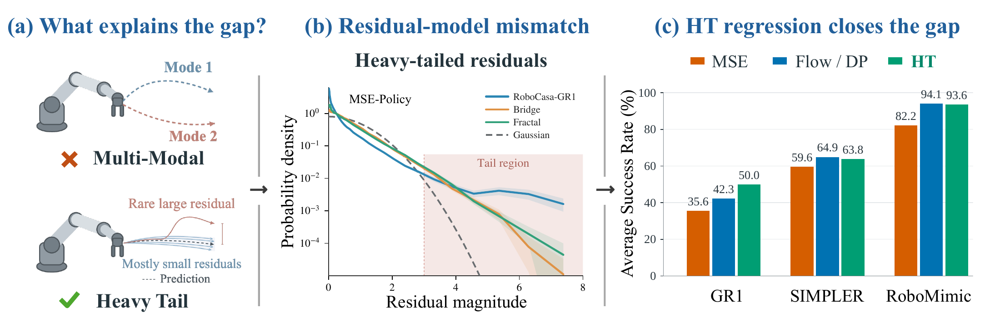
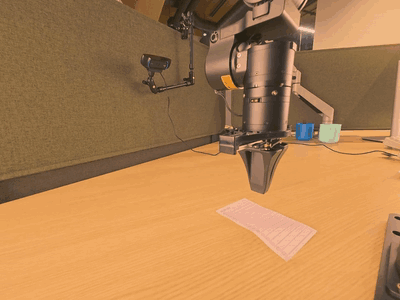
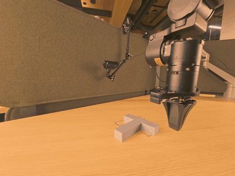
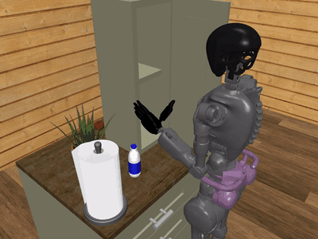
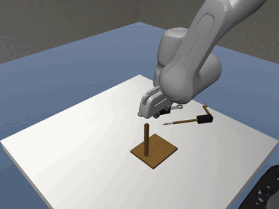

<h1 align="center">Residual Modeling for Regression Policies</h1>

<p align="center">
  <!-- Paper and Project Page URLs: pending. Keep the images adjacent for a continuous navigation bar. -->
  <picture><source media="(prefers-color-scheme: dark)" srcset="assets/readme/paper-dark.svg"><source media="(prefers-color-scheme: light)" srcset="assets/readme/paper.svg"></picture><picture><source media="(prefers-color-scheme: dark)" srcset="assets/readme/project-page-dark.svg"><source media="(prefers-color-scheme: light)" srcset="assets/readme/project-page.svg"></picture><a href="https://huggingface.co/collections/yuchen0187/regressionpolicy"><picture><source media="(prefers-color-scheme: dark)" srcset="assets/readme/models-dark.svg"><source media="(prefers-color-scheme: light)" srcset="assets/readme/models.svg"></picture></a>
</p>

<p align="center">
  <a href="#ht-loss-usage">HT-Loss</a> &emsp;&emsp;
  <a href="#installation">Installation</a> &emsp;&emsp;
  <a href="#training">Training</a> &emsp;&emsp;
  <a href="#evaluation">Evaluation</a>
</p>

<p align="center">
  <a href="assets/teaser.pdf"></a>
</p>

We revisit the gap between regression and generative policies from the perspective of statistic modeling. Our finding is the performance gap between MSE- and Flow-Policies is attributed to observation-dependent and heavy-tailed residuals. By modeling the heavy tails explicitly, our model (HT-Policy) achieves competitive performance with generative policies, with higher training and inference efficiency.

The first part of this repo provides an easy-to-use [HT-Loss implementation](#ht-loss-usage). It has an inferface similar to PyTorch's `MSELoss`. The second part provides code for our experiments on different benchmarks, starting from [installation](#installation).

<a id="release-plan"></a>

## <picture><source media="(prefers-color-scheme: dark)" srcset="assets/readme/icons/release-plan-dark.svg"></picture>&nbsp;&nbsp;Release Plan

- [x] PyTorch implementation of HT-Loss
- [x] RoboMimic training and evaluation code
- [x] VLA evaluation code
- [x] HT-Policy checkpoints for RoboMimic state policies
- [x] HT-Policy checkpoints for VLA/WAM models
- [ ] VLA/WAM training code
- [ ] HT-Policy checkpoints for RoboMimic vision policies
- [ ] Checkpoints trained with other objectives

<a id="ht-policy-demos"></a>

## <picture><source media="(prefers-color-scheme: dark)" srcset="assets/readme/icons/demos-dark.svg"></picture>&nbsp;&nbsp;HT-Policy Demos

<p align="center">
  
  
  
  
  <br>
  <picture>
    <source media="(prefers-color-scheme: dark)" srcset="assets/readme/demos-labels-dark.svg">
    <source media="(prefers-color-scheme: light)" srcset="assets/readme/demos-labels.svg">
    
  </picture>
</p>

<a id="ht-loss-usage"></a>

## <picture><source media="(prefers-color-scheme: dark)" srcset="assets/readme/icons/ht-loss-dark.svg"></picture>&nbsp;&nbsp;HT-Loss Usage

```bash
# From the repository root
uv pip install ./ht_loss
# pip install ./ht_loss
```

```python
from ht_loss import HTLoss

criterion = HTLoss()  # nu = 4d, where d = T * D
prediction, raw_scale = model(observations)  # [B, T, D], [B, 1]
loss = criterion(prediction, target, raw_scale)
loss.backward()
```

Add a scale head alongside your action head to predict `raw_scale` from shared features. Only PyTorch is required. See [HT-Loss](ht_loss/README.md) for the scale head example and options.

<a id="installation"></a>

## <picture><source media="(prefers-color-scheme: dark)" srcset="assets/readme/icons/installation-dark.svg"></picture>&nbsp;&nbsp;Installation

From this section, we provide codes for training and evaluating HT-Policy on different benchmarks. The first step is to install [uv](https://docs.astral.sh/uv/getting-started/installation/) and clone the repository:

```bash
git clone https://github.com/the-labone/RegressionPolicy.git
cd RegressionPolicy
```

Install the environment you need:

```bash
uv run scripts/install.py robomimic
```

**Options** — replace `robomimic` with your selection:

| Option | Environment |
| --- | --- |
| `robomimic` | RoboMimic training and evaluation |
| `gr1` | GR00T evaluation on RoboCasa-GR1 |
| `simpler` | GR00T evaluation on SimplerEnv |
| `pi05` | π0.5 evaluation on LIBERO |
| `cosmos` | Cosmos evaluation on LIBERO |

<a id="training"></a>

## <picture><source media="(prefers-color-scheme: dark)" srcset="assets/readme/icons/training-dark.svg"></picture>&nbsp;&nbsp;Training

### RoboMimic

#### Prepare dataset

```bash
# RoboMimic Lift PH — state observations
uv run scripts/download_robomimic.py --task lift --split ph --modality state

# RoboMimic Lift PH — image observations
uv run scripts/download_robomimic.py --task lift --split ph --modality vision
```

#### HT-Policy Transformer (State observations)

```bash
uv run --no-sync python -m ht_regression.training.train \
  experiment=robomimic/state/lift/ph/ht_transformer_nu200 \
  dataset.path=data/robomimic/lift/ph/low_dim_abs.hdf5
```

#### HT-Policy UNet (Image observations)

```bash
uv run --no-sync python -m ht_regression.training.train \
  experiment=robomimic/vision/lift/ph/ht_unet_nu200 \
  dataset.path=data/robomimic/lift/ph/image_abs.hdf5
```

| Argument | Options |
| --- | --- |
| `experiment=...` | [Task and backbone configurations](configs/experiment/robomimic) |
| `objective=...` | `ht`, `mse`, `flow`, `mip`, `diffusion` |

<a id="evaluation"></a>

## <picture><source media="(prefers-color-scheme: dark)" srcset="assets/readme/icons/evaluation-dark.svg"></picture>&nbsp;&nbsp;Evaluation

| Model | Benchmark | Checkpoints |
| --- | --- | --- |
| Transformer / UNet | RoboMimic | [Hugging Face](https://huggingface.co/yuchen0187/RegressionPolicy-RoboMimic) |
| GR00T | RoboCasa-GR1 | [Hugging Face](https://huggingface.co/yuchen0187/RegressionPolicy-GR00T/tree/main/gr1) |
| GR00T | SimplerEnv | [Hugging Face](https://huggingface.co/yuchen0187/RegressionPolicy-GR00T/tree/main/simpler) |
| π0.5 | LIBERO | [Hugging Face](https://huggingface.co/yuchen0187/RegressionPolicy-Pi0.5) |
| Cosmos | LIBERO | [Hugging Face](https://huggingface.co/yuchen0187/RegressionPolicy-Cosmos) |

### Transformer / UNet on RoboMimic

Download and evaluate the released Lift PH HT-Policy with a Transformer backbone:

```bash
uv run scripts/download_checkpoint.py robomimic \
  --path state/ht/lift_ph/ht-transformer

uv run scripts/evaluate.py robomimic \
  --checkpoint checkpoints/robomimic/state/ht/lift_ph/ht-transformer/best_nu100_last10-100.0.pt \
  --checkpoint-format release \
  --env-config configs/evaluation/robomimic/lift.json \
  --device cuda \
  --output-dir evaluation_results/robomimic_lift
```

You can specify the checkpoint to evaluate with `--checkpoint`.

### GR00T on RoboCasa-GR1

```bash
uv run scripts/download_checkpoint.py gr00t \
  --path gr1/checkpoint-60000

uv run scripts/evaluate.py gr1 \
  --checkpoint checkpoints/gr00t/gr1/checkpoint-60000 \
  --output-dir evaluation_results/gr1
```

### GR00T on SimplerEnv

Set `simpler_suite` to `bridge` or `fractal`:

```bash
simpler_suite=bridge
uv run scripts/download_checkpoint.py gr00t \
  --path simpler/${simpler_suite}/checkpoint-20000

uv run scripts/evaluate.py simpler \
  --checkpoint checkpoints/gr00t/simpler/${simpler_suite}/checkpoint-20000 \
  --suite ${simpler_suite} \
  --output-dir evaluation_results/simpler_${simpler_suite}
```

### π0.5 on LIBERO

```bash
uv run scripts/download_checkpoint.py pi05 \
  --path libero/checkpoint-30000/pretrained_model

uv run scripts/evaluate.py pi05 \
  --checkpoint checkpoints/pi05/libero/checkpoint-30000/pretrained_model \
  --output-dir evaluation_results/pi05
```

By default, all four LIBERO suites are evaluated. Add `--suite libero_10` to select one suite.

### Cosmos on LIBERO

```bash
uv run scripts/download_checkpoint.py cosmos --all

uv run scripts/evaluate.py cosmos \
  --checkpoint checkpoints/cosmos/libero_10/iter_000002000 \
  --method ht \
  --action-stats-path checkpoints/cosmos/libero_10/action_stats.json \
  --vae-path checkpoints/cosmos/assets/wan22_vae/Wan2.2_VAE.pth \
  --deterministic \
  --output-dir evaluation_results/cosmos
```
